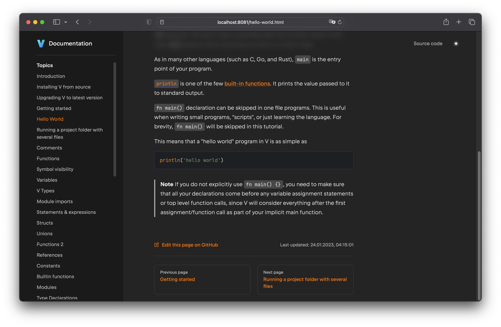

# V Documentation Generator



A simple generator to create multi-page documentation from the
original V [docs.md](https://github.com/vlang/v/blob/master/doc/docs.md)

## External dependencies

You'll need V, of course.  Best to
[install it from source](https://github.com/vlang/v?tab=readme-ov-file#installing-v-from-source)
if you don't already have it.

Make sure you have [sass](https://sass-lang.com/install/) installed
locally to build the css files.


## Contributing
To setup the generator and contribute changes to it, do this once:
```shell
git clone --branch generator https://github.com/vlang/docs docs_generator/
cd docs_generator/
v install
```
This will install all dependencies, and setup everything needed for you to generate
the documentation on your computer.


## Build the documentation
To build the documentation, after the setup, run the following commands:
```shell
v run .
sass --style compressed templates/assets/styles/style.scss:templates/assets/styles/style.css
```
This will install all dependencies, and generate the documentation in the `output` directory.


## Testing the output
```shell
v -e 'import net.http.file; file.serve(folder: "output/")'
```
Now load http://localhost:4001/ in your browser.
